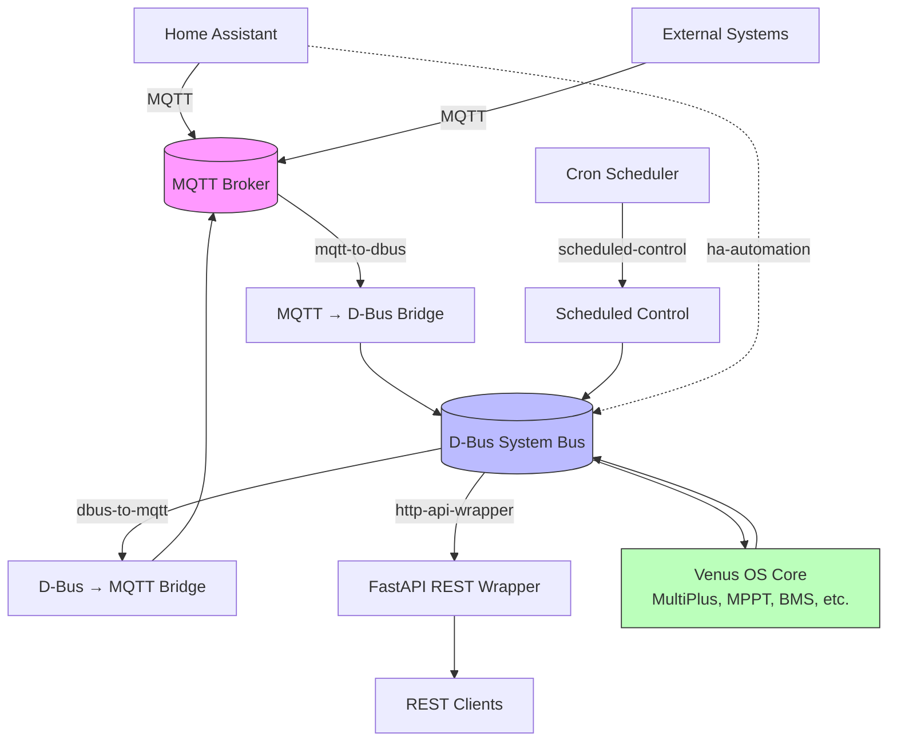

# Venus OS Integration Patterns

Reference implementations for common Victron Venus OS integrations. Each pattern is a complete, working example you can adapt for your own setup.

## Quick Start

```bash
# Clone this repo
git clone https://github.com/victron-venus/venus-os-integration-patterns.git

# Navigate to a pattern
cd venus-os-integration-patterns/patterns/mqtt-to-dbus

# Review the README, then start with docker-compose
docker-compose up -d
```

## Patterns

| Pattern | Description | Complexity | Dependencies |
|---------|-------------|------------|--------------|
| [mqtt-to-dbus](patterns/mqtt-to-dbus/) | Subscribe to MQTT topic, register D-Bus service, publish values | Beginner | paho-mqtt, dbus-python, systemd/docker |
| [dbus-to-mqtt](patterns/dbus-to-mqtt/) | Monitor D-Bus path changes, publish to MQTT | Beginner | dbus-python, paho-mqtt |
| [http-api-wrapper](patterns/http-api-wrapper/) | FastAPI wrapper around D-Bus for REST access | Intermediate | fastapi, dbus-python, uvicorn |
| [scheduled-control](patterns/scheduled-control/) | Time-based inverter mode switching via cron | Beginner | python-cron, dbus-python |
| [ha-automation](patterns/ha-automation/) | Home Assistant automation YAML for Venus OS entities | Beginner | Home Assistant, MQTT |

## Architecture Overview



## Requirements

- **Venus OS** (Cerbo GX, Raspberry Pi with Venus OS, or Venus OS Docker)
- **MQTT Broker** (Mosquitto, EMQX, or cloud broker)
- **Python 3.10+** for Python patterns
- **Docker** (optional, for containerized deployment)

## Contributing

1. Fork the repository
2. Create a new pattern directory under `patterns/`
3. Include: `README.md`, working code, `docker-compose.yml`, `tests/`
4. Add entry to the patterns table above
5. Submit a PR

## License

MIT License — see [LICENSE](LICENSE) for details.

## Related Projects

- [venus-os-ci-toolkit](https://github.com/victron-venus/venus-os-ci-toolkit) — Reusable CI/CD workflows
- [dbus-mqtt-battery](https://github.com/victron-venus/dbus-mqtt-battery) — Production JBD BMS MQTT↔D-Bus bridge
- [dbus-tasmota-pv](https://github.com/victron-venus/dbus-tasmota-pv) — Production Tasmota PV inverter D-Bus bridge
- [inverter-control](https://github.com/victron-venus/inverter-control) — Grid-zero feed-in control