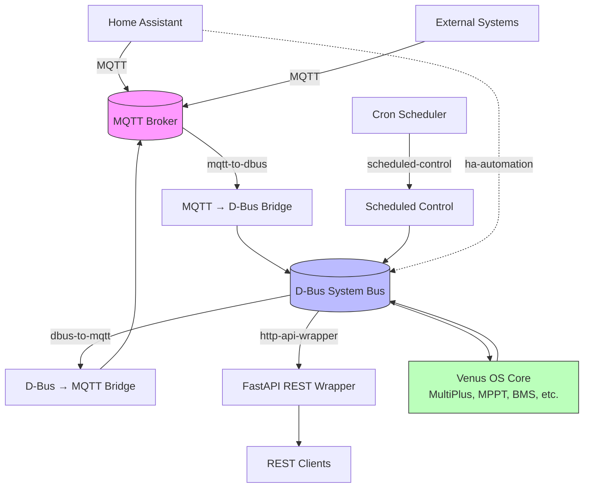

# Venus OS Integration Patterns

## Native GX versus companion-host examples

These patterns are examples, not certified device installers. Venus OS on Cerbo
GX or Raspberry Pi uses daemontools (`svc`, `svstat`), not systemd. Keep native
runtime/configuration under `/data`, recreate `/service` links from `/data/rc.local`,
and bound logs with `multilog` under `/var/log`. Prepare offline dependencies
matching the firmware's Python ABI/CPU; retain firmware-provided D-Bus/GLib
bindings with a virtualenv using `--system-site-packages`.

Docker/Compose examples target a separate Linux host with suitable D-Bus access.
They do not imply Docker support on a stock Venus OS image. A host reaching only
the Cerbo over TCP should use the built-in MQTT gateway; a mounted D-Bus socket
is local to the container host. Measure signal rates, memory and disconnected
broker behavior before deploying a new bridge to a GX.


Reference implementations for common Victron Venus OS integrations. Each pattern is a complete, working example you can adapt for your own setup.

<!-- ci-release-process:start -->
## CI and deployment

See [CI and deployment workflow](docs/release-workflow.md) for required checks and local commands. This repository uses validation-only policy; application release channels do not apply.
<!-- ci-release-process:end -->

## Quick Start

```bash
# Clone this repo
git clone https://github.com/victron-venus/venus-os-integration-patterns.git

# Navigate to a pattern
cd venus-os-integration-patterns/patterns/mqtt-to-dbus

# Review the README, then start with docker-compose
docker-compose up -d
```

## Patterns

| Pattern | Description | Complexity | Dependencies |
|---------|-------------|------------|--------------|
| [mqtt-to-dbus](patterns/mqtt-to-dbus/) | Subscribe to MQTT topic, register D-Bus service, publish values | Beginner | paho-mqtt, dbus-python, systemd/docker |
| [dbus-to-mqtt](patterns/dbus-to-mqtt/) | Monitor D-Bus path changes, publish to MQTT | Beginner | dbus-python, paho-mqtt |
| [http-api-wrapper](patterns/http-api-wrapper/) | FastAPI wrapper around D-Bus for REST access | Intermediate | fastapi, dbus-python, uvicorn |
| [scheduled-control](patterns/scheduled-control/) | Time-based inverter mode switching via cron | Beginner | python-cron, dbus-python |
| [ha-automation](patterns/ha-automation/) | Home Assistant automation YAML for Venus OS entities | Beginner | Home Assistant, MQTT |

## Architecture Overview



## Requirements

- **Venus OS** (Cerbo GX, Raspberry Pi with Venus OS, or Venus OS Docker)
- **MQTT Broker** (Mosquitto, EMQX, or cloud broker)
- **Python 3.10+** for Python patterns
- **Docker** (optional, for containerized deployment)

## Contributing

1. Fork the repository
2. Create a new pattern directory under `patterns/`
3. Include: `README.md`, working code, `docker-compose.yml`, `tests/`
4. Add entry to the patterns table above
5. Submit a PR

## License

MIT License — see [LICENSE](LICENSE) for details.

## Related Projects

- [venus-os-ci-toolkit](https://github.com/victron-venus/venus-os-ci-toolkit) — Reusable CI/CD workflows
- [dbus-mqtt-battery](https://github.com/victron-venus/dbus-mqtt-battery) — Production JBD BMS MQTT↔D-Bus bridge
- [dbus-tasmota-pv](https://github.com/victron-venus/dbus-tasmota-pv) — Production Tasmota PV inverter D-Bus bridge
- [inverter-control](https://github.com/victron-venus/inverter-control) — Grid-zero feed-in control
