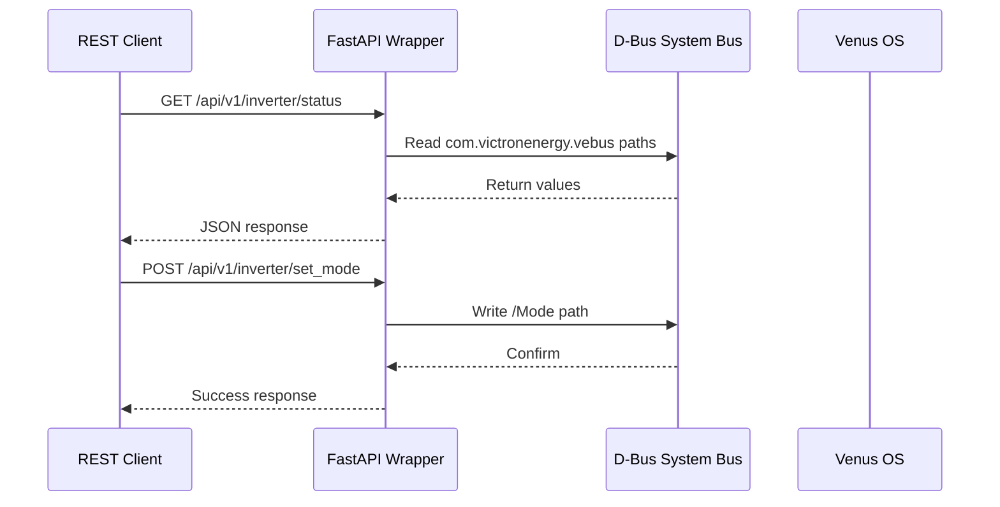

# HTTP API Wrapper Pattern

FastAPI REST wrapper around D-Bus for Venus OS. Provides REST endpoints for inverter control and monitoring without direct D-Bus access.

## Use Cases

- REST API for custom dashboards
- Integration with systems that only speak HTTP
- Secure remote access via standard auth (API keys, OAuth)

## Architecture



## Configuration

```yaml
server:
  host: "0.0.0.0"
  port: 8080
  api_key: "your-secure-api-key"  # Optional auth

dbus:
  services:
    vebus: "com.victronenergy.vebus.ttyO1"
    battery: "com.victronenergy.battery.ttyUSB0"
    solar: "com.victronenergy.solarcharger.ttyUSB1"

endpoints:
  - path: "/api/v1/inverter/status"
    method: "GET"
    dbus_service: "vebus"
    paths:
      - "/Ac/Out/ActivePower"
      - "/Ac/Out/L1/Voltage"
      - "/Mode"
      - "/State"

  - path: "/api/v1/inverter/set_mode"
    method: "POST"
    dbus_service: "vebus"
    write_path: "/Mode"
    body_param: "mode"
```

## Running

```bash
docker-compose up -d
# API available at http://localhost:8080/docs
```

## Files

| File | Description |
|------|-------------|
| `src/http_api.py` | FastAPI application |
| `config.yaml.example` | Example configuration |
| `docker-compose.yml` | Docker deployment |
| `Dockerfile` | Container image |
| `requirements.txt` | Python dependencies |

## Security

- Add API key authentication via `api_key` in config
- Use HTTPS in production (reverse proxy with TLS)
- Rate limit with nginx or similar