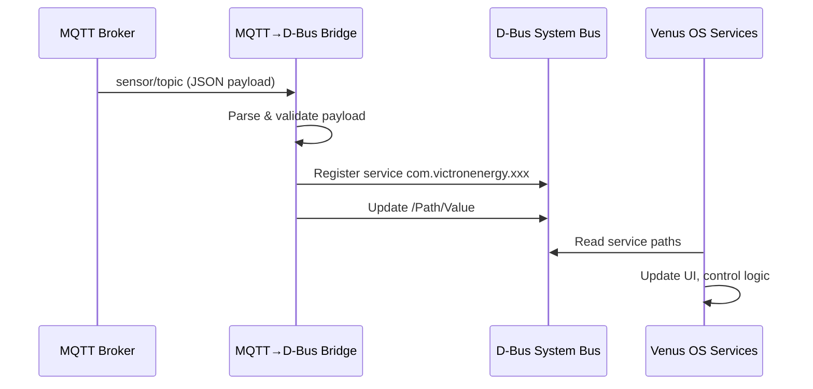

# MQTT → D-Bus Bridge Pattern

Subscribe to MQTT topics and publish values as D-Bus services on Venus OS. This is the foundation for integrating external sensors (temperature, humidity, custom meters) into the Venus OS ecosystem.

## Use Cases

- Bridge Home Assistant sensor data to Venus OS
- Publish custom ESPHome/CT sensor readings as D-Bus grid meters
- Integrate third-party MQTT devices (Shelly, Tasmota, ESPHome) with Venus OS

## Architecture



## Configuration

Copy `config.yaml.example` to `config.yaml` and adjust:

```yaml
mqtt:
  host: "mqtt-broker"
  port: 1883
  username: ""
  password: ""
  client_id: "mqtt-to-dbus-bridge"

dbus:
  service_name: "com.victronenergy.mqtt_sensor"
  device_instance: 40  # 0-255, unique per service

mappings:
  - mqtt_topic: "homeassistant/sensor/living_room_temperature/state"
    dbus_path: "/Temperature"
    dbus_type: "double"
    unit: "°C"
    value_template: "{{ value_json.temperature }}"
  
  - mqtt_topic: "homeassistant/sensor/living_room_humidity/state"
    dbus_path: "/Humidity"
    dbus_type: "double"
    unit: "%"
    value_template: "{{ value_json.humidity }}"
```

### Mapping Fields

| Field | Required | Description |
|-------|----------|-------------|
| `mqtt_topic` | Yes | MQTT topic to subscribe |
| `dbus_path` | Yes | D-Bus object path (must start with `/`) |
| `dbus_type` | Yes | D-Bus type: `double`, `int32`, `uint32`, `string`, `boolean` |
| `unit` | No | Unit for display (e.g., °C, %, W, V, A) |
| `value_template` | No | Jinja2 template to extract value from JSON payload |
| `default` | No | Default value if MQTT message not received |

## Running

### With Docker (Recommended)

```bash
docker-compose up -d
```

### Direct Python

```bash
pip install -r requirements.txt
cp config.yaml.example config.yaml
# edit config.yaml
python src/mqtt_to_dbus.py
```

## Files

| File | Description |
|------|-------------|
| `src/mqtt_to_dbus.py` | Main bridge implementation |
| `config.yaml.example` | Example configuration |
| `docker-compose.yml` | Docker deployment |
| `Dockerfile` | Container image |
| `tests/test_mqtt_to_dbus.py` | Unit tests |
| `requirements.txt` | Python dependencies |

## Requirements

- Python 3.10+
- `paho-mqtt >= 2.0`
- `dbus-python >= 1.3`
- `pyyaml >= 6.0`
- `jinja2 >= 3.1` (for value templates)

## D-Bus Service Registration

The bridge registers a D-Bus service with the following standard paths:

```
/DeviceInstance          (uint32) - Unique instance number
/ProductId              (uint16) - Product ID (0xFFFF for generic)
/ProductName            (string) - Human-readable name
/FirmwareVersion        (string) - Bridge version
/Connected              (uint8)  - 1 = connected, 0 = disconnected
/CustomName             (string) - User-defined name
/Paths/                 - Dynamic paths from config mappings
```

## Extending

To add new sensor types:

1. Add mapping to `config.yaml`
2. For complex transformations, add a processor function in `src/processors.py`
3. Reference it in mapping: `processor: "processors.convert_fahrenheit_to_celsius"`

## Testing

```bash
# Run unit tests
pytest tests/

# Test with mock MQTT broker
docker-compose -f docker-compose.test.yml up --abort-on-container-exit
```

## Troubleshooting

| Issue | Solution |
|-------|----------|
| "Service already exists" | Change `device_instance` in config |
| "Permission denied" on D-Bus | Run with `--network host` or add D-Bus policy |
| Values not updating | Check MQTT topic matches, verify JSON path in template |
| Bridge not connecting | Verify MQTT host/port, check firewall |

## See Also

- [D-Bus → MQTT Bridge](../dbus-to-mqtt/) — Opposite direction
- [dbus-mqtt-battery](https://github.com/victron-venus/dbus-mqtt-battery) — Production JBD BMS implementation
- [Victron D-Bus Docs](https://github.com/victronenergy/venus-dbus-api)